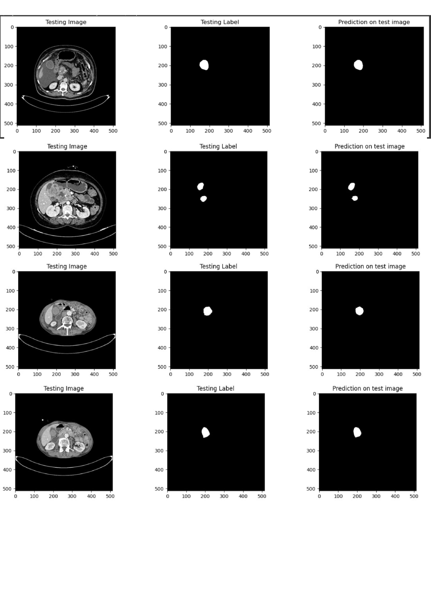

---

# Gallbladder Cancer (GBC) Detection and Segmentation using CNN and Transfer Learning

## Overview
This project proposes a deep learning approach for the early detection and segmentation of Gallbladder Cancer (GBC) using Convolutional Neural Networks (CNN). The project is based on two main tasks:

1. **Segmentation of Gallbladder Cancer (GBC):** We employ a U-Net architecture with ResNet50 as the encoder, enhanced with an additional convolutional block with a dilation rate of 2 to better capture features with a higher receptive field while minimizing spatial resolution loss.
2. **Classification for Cancer Detection:** Transfer learning is applied using the EfficientNet-B0 pre-trained model for accurate cancer detection, leveraging its efficiency and preventing overfitting or vanishing gradient issues.

Gallbladder Cancer (GBC) accounts for 95% of malignant tumors in the biliary system and is particularly dangerous due to late detection in most patients. This model aims to assist in early-stage detection, which is crucial for improving patient outcomes.

## Model Architecture

### Segmentation Model
- **Base Model:** U-Net
- **Encoder:** ResNet50 (using transfer learning)
- **Additional Features:**
  - A custom convolutional block with a dilation rate of 2 is added for improved feature extraction.
  - Dice Coefficient and Mean Intersection over Union (IoU) are used as the loss functions to enhance segmentation accuracy.

### Classification Model
- **Base Model:** EfficientNet-B0 (using transfer learning)
- **Objective:** To classify images for the presence of cancer.
- **Evaluation Metrics:**
  - F1-Score: 0.9790
  - Precision: 0.9690
  - Recall: 0.9894
  - Accuracy: 0.9730

## Results
- **Segmentation:**
  - Mean IoU: 0.86
  - Dice Coefficient: 0.81
- **Cancer Detection:**
  - F1-Score: 0.9790
  - Precision: 0.9690
  - Recall: 0.9894
  - Accuracy: 0.9730

These results demonstrate the robustness of the proposed model in both the segmentation and detection tasks.

## Installation

1. **Clone the repository:**
   ```bash
   git clone https://github.com/yourusername/gbc-detection-segmentation.git

## Dataset
The dataset used in this project consists of medical images from patients with Gallbladder Cancer (GBC). Due to medical privacy, the dataset is not included in this repository. However, you can use publicly available medical datasets for training and evaluation, such as those found in [The Cancer Imaging Archive (TCIA)](https://www.cancerimagingarchive.net/).

To prepare the dataset:
- Organize the images into appropriate directories for segmentation and classification tasks.
- Preprocess the images, including resizing, normalization, and augmentation.

## Results



## Conclusion
This project demonstrates the potential of deep learning in the early detection and segmentation of Gallbladder Cancer (GBC). The combined architecture of U-Net with ResNet50 for segmentation and EfficientNet-B0 for classification has yielded promising results, showing improved segmentation accuracy and reliable cancer detection.

## References
- Batra et al., 2005
- Randi et al., 2006

---

